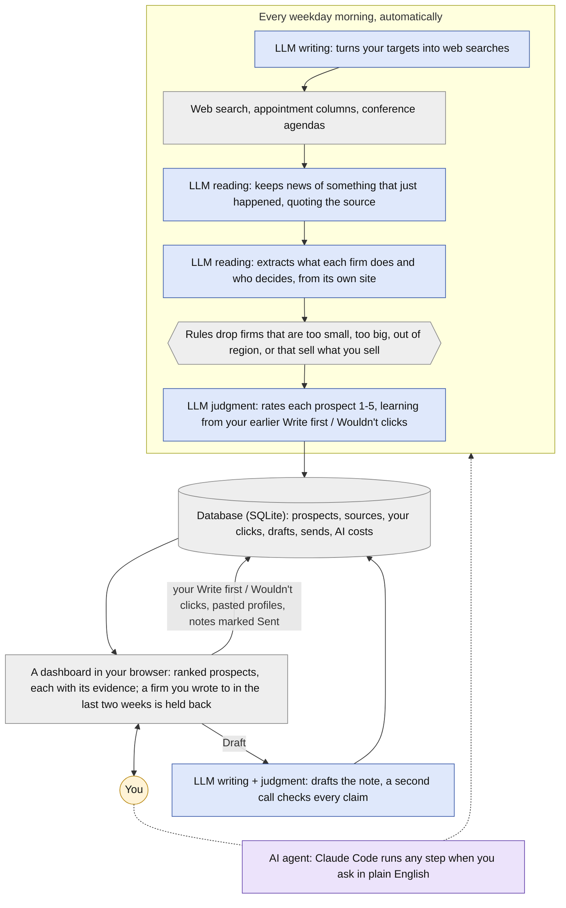

# prospect-scanner

**An AI system that searches public online sources for consulting prospects, decides
which are worth your time, drafts the first note and revises it with you until it's
right, and grades its own work.** Built by a one-person AI practice to find its own
clients, and used nearly every day.

Lead generation is mostly research: *Which firms just did something that gives me a
reason to write? Is this one worth an hour? Who inside it can actually decide?* This
does that research from public evidence, turns hours of reading into minutes of
deciding, and hands a person a short list of prospects and draft notes to them
(emails, LinkedIn messages). A person sends every note.

A working morning. The firms and prospects are fictional; the LinkedIn profile is the author's own.

**Author:** Joseph M. Hahn, Ph.D., independent AI and machine learning consultant  
[jmh-datasciences.com](https://jmh-datasciences.com) · [LinkedIn](https://www.linkedin.com/in/hahnjoe) · jmh.datasciences@gmail.com  
**Built end-to-end with Claude Code.** · **License:** [PolyForm Noncommercial](#license)

---

## What it does

- **Finds people with a dated reason to talk:** a new AI leader named, a vendor
  chosen, a fund raised, a conference talk about a problem worth solving. Not lists.
- **Vets each firm from its own website:** what it does, how big it is, who decides,
  and for an investment firm, whose boards each partner sits on.
- **Rates every candidate with a judge that learns from you:** no scoring rules, just
  whether you clicked Write first or Wouldn't on similar people, and it gets better with every click.
- **Drafts the note in your voice,** from a handful of notes you actually sent, then
  checks every factual claim against the evidence before you see it.
- **Measures itself:** every model call is costed, every claim is sourced, and the
  AI judge is scored against a simple scoring formula run alongside it, using your
  own write / don't-write calls as the answer key ([how](docs/measurement.md)).

Blue: a single LLM call (Claude) for reading, judgment or writing, each with a structured output. Purple: an AI agent that uses tools. Grey: deterministic code, search, and the database every step reads and writes. Amber: you.

## Where AI is used, and where it deliberately isn't

Each step gets the least powerful tool that does the job well. The strongest model,
Claude Opus, writes the outreach notes, because that is the one thing a stranger reads
and the one place quality matters most. Reading hundreds of search results and web pages
a day is high volume and needs less judgment, so smaller, cheaper models do it. Anything
that can be computed uses no AI at all.

| Step and model | What it does, and why AI rather than code |
|---|---|
| **LLM reading** Claude Haiku, Sonnet | Turns Tavily search results and web pages into structured facts: keeps only real, dated events, and extracts what a firm does, who decides, and whose boards a partner sits on. Finding a firm's own website uses Claude with Anthropic's web search tool. Pages vary endlessly; a fixed schema keeps the output checkable. |
| **LLM judgment** Claude Sonnet | Rates each prospect 1-5 from your own Write first / Wouldn't clicks, and works out what the person is after and which offer fits. Your taste is learned from examples, not written as rules. |
| **LLM writing** Claude Opus | Drafts the note and revises it on request, then a separate call checks every claim against its source. The most capable model for the one output a stranger reads, and the writer never grades its own work. |
| **AI agent** Claude Code | Runs any step when you ask in plain English. Open-ended requests need an agent that can use tools. |
| **No AI** deterministic code | News and event search (Tavily's search API), fetching, robots.txt, the gates, the baseline score, storage, the dashboard and cost tracking. Anything that can be computed is computed, and tested. |

Each step's model is set in config, and every call's cost is recorded, so moving a step
to a cheaper model is a measured decision.

## How it's used

- **Each weekday morning** a scheduled run finds new dated events, vets the firms
  behind them, and has the judge rate the people it finds.
- **You open the Ready page:** a short list of prospects, best first. Each card
  describes the person and their role, what their firm does, what just happened that
  makes now a good time to write (with sources), whether they hold the budget, and
  the cheapest way to reach them.
- **You make the call:** Write first, Would write or Wouldn't, with a few words why.
  The judge learns from every click.
- **For anyone worth writing to,** you can paste their LinkedIn profile (copied from
  your own browser) into the card, which gives the AI more to go on and sharpens its
  rating. Then press Draft to have the AI compose a note to them, ask for changes in
  plain words until it sounds like you, send it yourself by email or LinkedIn, and
  press Sent.
- **You log replies,** and the Scoreboard, Searches and Spend pages show what is
  working and what it costs.
- **Any step also runs from the command line,** or by asking Claude Code in plain
  English. It runs on Claude, but every model call goes through one small adapter, so
  another provider is a contained change (see [Setup](docs/setup.md)).

## Read more

- **[How it works](docs/how-it-works.md):** the pipeline, the judge, the pages, the drafter.
- **[How it measures itself](docs/measurement.md):** the scoreboard, cost, search yield, and the design choices they support.
- **[Guardrails](docs/guardrails.md):** what it will never do, and how that is enforced.
- **[Set it up for your business](docs/setup.md):** quickstart, the two config files, adapting it.

## Where the real work is

The interesting work is not the scraper. It is deciding what disqualifies a prospect
before looking at any, being willing to retire a pitch the evidence proves wrong, and
keeping the record of every judgment the thing got wrong where I still have to look
at it.

The hardest part is the note itself: saying the one thing that matters to this
person, and offering the one thing that fits best. What works is a five-beat recipe taken
from notes I actually sent: their situation, stated as a plain fact; one line
claiming the work that matches it; the credential; what I sell; a soft ask. Before a
word is drafted, the AI works out what the prospect is trying to do and which offer
fits, and anything I have said about them outranks its guesses. Then every claim in
the draft is checked against its source.

## License

[PolyForm Noncommercial 1.0.0](LICENSE.md). Free to use, modify and share for any
**noncommercial** purpose. Commercial use, including running it to find clients for
your own firm, is reserved.

If you want to use it commercially, or you want one tuned to your market, your
offers and your voice, that is what I do:
**[jmh-datasciences.com](https://jmh-datasciences.com)** · jmh.datasciences@gmail.com
