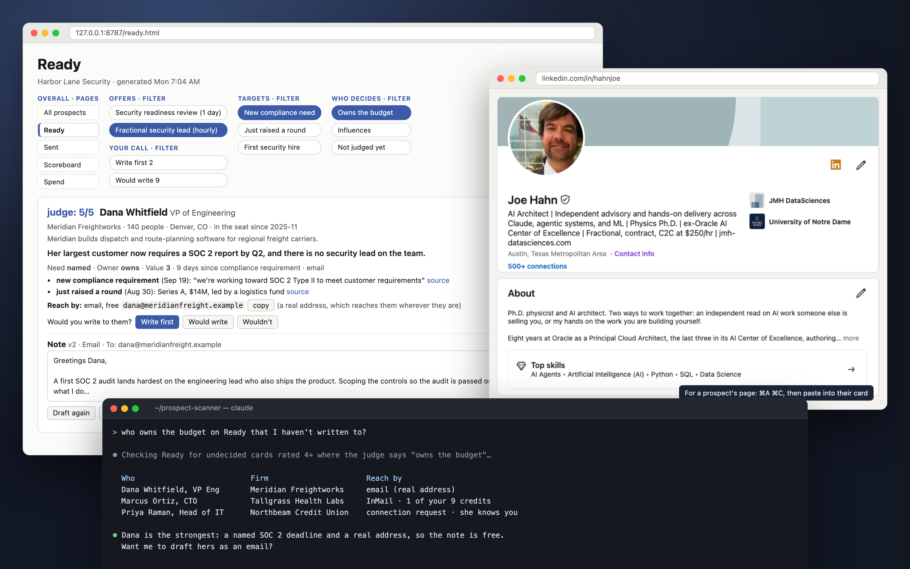
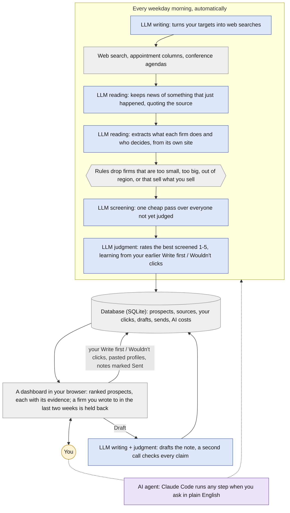

# prospect-scanner

**I built an AI system that finds consulting prospects in public sources, decides
which are worth my time, drafts the first note, revises it with me until it sounds
like me, and grades its own work.** I'm a one-person AI practice, this is how I find
my own clients, and I use it nearly every day.

Finding clients is mostly research. Which firms just did something that gives me a
reason to write? Is this one worth an hour? Who there can actually say yes? This
does that research from public evidence, so hours of reading become minutes of
deciding. Each morning I get a short list of people and, when I ask, a draft note to
each. I edit and send every note myself, by email or LinkedIn.

A working morning. The firms and prospects are fictional; the LinkedIn profile is my own.

**Author:** Joseph M. Hahn, Ph.D., independent AI and machine learning consultant  
[jmh-datasciences.com](https://jmh-datasciences.com) · [LinkedIn](https://www.linkedin.com/in/hahnjoe) · joe.hahn@jmh-datasciences.com  
**Built end-to-end with Claude Code.** · **License:** [PolyForm Noncommercial](#license)

---

## What it does

- **Finds people with a dated reason to talk.** A new AI leader named, a vendor
  chosen, a fund raised, a conference talk about a problem worth solving. Not lists
  of names.
- **Vets each firm from its own website.** What it does, how big it is, who decides,
  and for an investment firm, whose boards each partner sits on.
- **Rates every prospect with an AI judge that learns from me.** There are no scoring
  rules. It learns from my calls on similar people, Write first or Wouldn't, and gets
  better with each one.
- **Drafts the note in my voice,** from notes I actually sent, then checks every
  factual claim against its source before I see it.
- **Measures itself.** Every model call is costed, every claim is sourced, and the AI
  judge is scored against a plain formula run beside it, using my own write and
  don't-write calls as the answer key ([how](docs/measurement.md)).

Blue: a single LLM call (Claude) for reading, judgment or writing, each with a structured output. Purple: an AI agent that uses tools. Grey: deterministic code, search, and the database every step reads and writes. Amber: you.

## Where AI is used, and where it isn't

Each step gets the least powerful tool that does the job well. The strongest model,
Claude Opus, writes the notes, because a note is the one thing a stranger reads.
Reading hundreds of search results and web pages a day is high volume and needs less
judgment, so smaller, cheaper models do that. Anything that can be computed uses no
AI at all.

| Step and model | What it does, and why AI rather than code |
|---|---|
| **LLM reading** Claude Haiku, Sonnet | Turns Tavily search results and web pages into structured facts: keeps only real, dated events, and pulls out what a firm does, who decides, and whose boards a partner sits on. Finding a firm's own website uses Claude with Anthropic's web search tool. Pages vary endlessly, and a fixed schema keeps the output checkable. |
| **LLM screening** Claude Haiku | Asks the judge's question once, with the same prompt and evidence, on the cheap model, so the judge's three runs go only to people worth them. I measure how well the screen predicts the judge, and set its pass mark from that. |
| **LLM judgment** Claude Sonnet | Rates each prospect 1-5 from my own Write first / Wouldn't calls, and works out what the person is after and which offer fits. My taste is learned from examples, not written down as rules. |
| **LLM writing** Claude Opus | Works out the note's storyline, drafts it, and revises it when I ask. A separate call then checks every claim against its source before the note is saved. |
| **LLM grading** Claude Fable | Grades each morning's drafts with a different model from the one that wrote them, so no model grades its own work. Are the claims on file? Does the note recite the reader's own facts back to them? Does it claim anything I never claim, break a channel rule, or point at something that isn't there? A failing draft is flagged on its card with the words that failed, and every grade is kept, so a defect rate traces back to the model and prompt that wrote the note. |
| **AI agent** Claude Code | Runs any step when I ask in plain English. Open-ended requests need an agent that can use tools. |
| **No AI** deterministic code | News and event search (Tavily's search API), fetching, robots.txt, the gates, the baseline score, storage, the dashboard and cost tracking. Anything that can be computed is computed, and tested. |

Each step's model is set in config and every call's cost is recorded, so moving a
step to a cheaper model is a measured decision, not a hunch. The morning's screening,
judging and grading go through the Batches API at half price, since nobody reads them
until later, and the part of the judge's prompt that is the same for every person is
cached.

## How I use it

- **Each weekday morning** a scheduled run finds new dated events and conferences,
  vets the firms behind them, screens everyone not yet judged, has the judge rate the
  best, and researches the strongest people I haven't pasted a profile for. That
  research covers what third parties publish about them (news, interviews, podcasts,
  directories), every fact with its page, LinkedIn blocked. Those people are judged
  again on what it found, and the run ends with a short list of profiles for me to
  paste. The Funnel page counts each day against two goals: strong prospects found,
  and notes sent.
- **I open the Ready page.** It's a short list, best first. Each card says who the
  person is, what their firm does, what just happened that makes now a good time to
  write (with sources), whether they hold the budget, and the cheapest way to reach
  them.
- **I make the call:** Write first, Would write or Wouldn't, with a few words why.
  The judge learns from every one.
- **For anyone worth writing to,** I paste their LinkedIn profile from my own
  browser into the card, which gives the AI more to go on. Then I press Draft, ask
  for changes in plain words until it sounds like me, send it myself, and press
  Sent. Each draft is graded on the spot.
- **I log replies.** The Scoreboard, Searches and Spend pages show what's working and
  what it costs.
- **Any step also runs from the command line,** or by asking Claude Code in plain
  English. It runs on Claude, but every model call goes through one small adapter, so
  switching providers is a contained change (see [Setup](docs/setup.md)).

## Read more

- **[How it works](docs/how-it-works.md):** the pipeline, the judge, the pages, the drafter.
- **[How it measures itself](docs/measurement.md):** the scoreboard, cost, search yield, and the design choices they support.
- **[Guardrails](docs/guardrails.md):** what it will never do, and how that's enforced.
- **[Set it up for your business](docs/setup.md):** quickstart, the config files, adapting it.

## Where the real work is

The scraper is the easy part. The real work is deciding what disqualifies a prospect
before looking at any, being willing to retire a pitch when the evidence says it
doesn't work, and keeping a record of every call the system got wrong, where I still
have to look at it.

The hardest part is the note itself: saying the one thing that matters to this
person, and offering the one thing that fits. Before a word is written, the AI works
out what the person is trying to achieve, and says whether they stated it or it's a
guess from the facts. From there it builds one storyline: an opening from something
they said or did recently, why an AI consultant is a natural next step, and the offer
that follows. A guess about what someone wants can shape the note, but the note only
states facts, and anything I've said about the person outranks the AI's guesses. Then
every claim in the draft is checked against its source.

The lesson I'd pass on: an expert's everyday calls are training data you already
produce. Capture the call and the reason when it's made, feed back examples instead
of rules, and keep a simple baseline beside it, so you know whether it's learning.

## License

[PolyForm Noncommercial 1.0.0](LICENSE.md). Free to use, modify and share for any
**noncommercial** purpose. Commercial use, including running it to find clients for
your own firm, is reserved.

If you want to use it commercially, or want one tuned to your market, your offers and
your voice, that's what I do:
**[jmh-datasciences.com](https://jmh-datasciences.com)** · joe.hahn@jmh-datasciences.com
