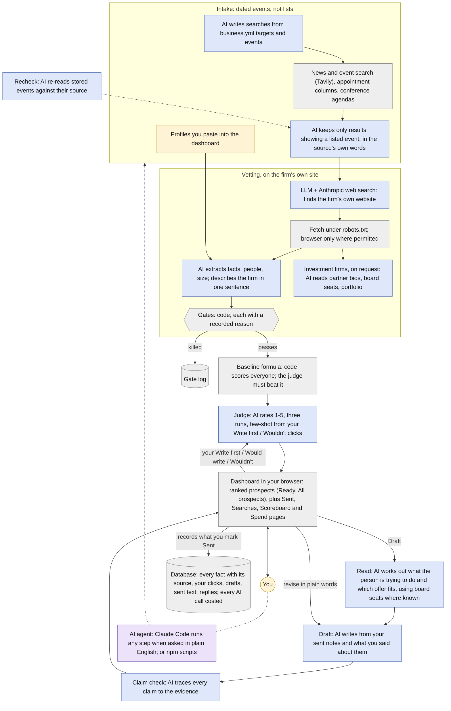

# How it works

[← README](../README.md) · [Measurement](measurement.md) · [Guardrails](guardrails.md) · [Setup](setup.md)

Blue: a single LLM call (Claude) with a structured output. Purple: an AI agent that uses tools. Grey: deterministic code, search and storage. Amber: you.

## Intake: dated events, not lists

A prospect enters because something happened: a new AI leader named, a vendor chosen,
a fund raised, a conference talk about a problem the operator solves. Five sources:

- **Measured searches.** Written by a model from the operator's plain-prose targets and
  events, approved once, run weekly. Each run records what it found and what each find
  became (vetted, rated, written to, replied). A search that finds nothing twice in a
  row retires itself. An event can be marked as found in first-person writing (posts,
  talks, podcasts) rather than news, and its searches then cover the whole web.
- **Appointment columns** in trade press, for newly named data and AI leaders.
- **Conference agendas,** read from the organiser's own pages: a speaker and the
  session they are giving arrive together. New conferences are found where the
  operator's example prospects speak and through searches written from the
  targets, then read with a general reader that keeps only speakers the page
  itself names.
- **The operator's pastes** of a profile they read themselves, stored with a
  provenance marker so they are never mistaken for something retrieved.
- **Firm lists,** for a target limited to one kind of firm that publishes no events,
  such as small recruiting firms that place contractors. Rankings and directories are
  found and read for firm names; each firm waits outside the book until its own site
  has been checked. It is admitted only if the site makes it the target's kind,
  looks like the firm of an example prospect the operator named for that target,
  no gate kills it, and it names someone in one of the target's seats. Everyone else at
  an admitted firm is dropped, and every firm turned away keeps its reason.

Every stored event keeps what its source actually said, not just an event label, and
`npm run recheck` re-reads older ones against their source and retracts any the words
do not support.

## Vetting and gates

**Finding the firm's website** is a Claude call with Anthropic's web search tool, a
couple of searches at most per firm; searching for events is Tavily's search API. Both
are costed in the same ledger.

**Vetting reads the firm's own site,** under its `robots.txt`: what it does, in one
plain sentence rather than its slogan; how big it is; who is named. A page that
redirects to a different business is refused. A browser is used only where
`robots.txt` permits the page and a plain fetch cannot read it, and the run records
when it was needed.

**For an investment firm** (`npm run bios`), each person's bio is read for their
committees and board seats, and the portfolio page for the companies it holds. Each
current portfolio company enters the book linked to the partner on its board, so one
note to a partner can point at a named company, and a card at that company shows who
owns it and who sits on its board. A page that is really the team list served at every
bio address is detected and discarded.

**Gates are code, not judgment.** Too small, too big, already staffed for the work, a
marketplace, a recent note to the same firm: each is a function with a recorded
reason, and a killed firm stays in the log with why. A talent marketplace or expert
network is killed; a staffing firm whose recruiters place contractors is a separate
kind, and passes.

## The judge

The judge rates each person 1 to 5 on how compelling a note would be, three times, and
keeps the median; a spread of two or more is shown. It is given no scoring rules.
It is given the operator's past calls on the most similar people (write first, would
write, wouldn't, each with the reason given), and its reasons cite evidence by id. It
also rates who decides (owns the budget, influences, or neither) and records which
target the person fits. Each call the operator makes becomes an example for the next.

A simple weighted scoring formula runs alongside it on the same people, as the
baseline it is measured against ([measurement](measurement.md)).

## The dashboard

Static HTML pages generated from the database, opened from disk or through a small
form server (`npm run inbox`, bound to 127.0.0.1, started by hand) that records the
operator's clicks, pastes and sends into the database.

- **All prospects:** everyone not yet written to, in the judge's order.
- **Ready:** the short list, rated 3 and up.
- **To paste:** promising people whose profile the operator has not read yet.
- **Sent, Searches, Scoreboard, Spend, Gate log, Inputs.**

Every prospect on these pages is a **card**: one person, with everything needed to
decide whether to write to them and how. Both working pages filter their cards in
place by target, offer, geography, the operator's call, who decides, and whether a
profile has been pasted.

### What a card shows

Top to bottom:

- **The judge's rating, the person and their title,** then the firm and what it does
  in one plain sentence, with a link to its site.
- **The reason to write.**
- **Need, owner, value:** whether the firm has a named need, whether this person owns
  the budget or only influences it, and how big the work could be; then how many days
  since the triggering event, and the suggested channel. *Why, in full* opens the
  judge's reasoning, each point tied to its evidence.
- **Events and facts,** each dated, in the source's own words, with a link to the
  source. Facts from a profile the operator pasted are marked as theirs.
- **Reach by:** the channel to use and why. A real address first, a message if
  connected, a connection request for someone who knows the operator, a paid InMail
  only for cards worth a credit, and a guessed address marked as a guess. A known
  address has a copy button. Channels already tried are skipped.
- **A profile search link,** which the operator clicks to find the person themselves,
  and a box to paste the profile they read.
- **The operator's call:** *Write first*, *Would write* or *Wouldn't*, with a word of
  reason. These clicks are what the judge learns from.
- **The note:** the latest draft, the channel and its recipient, a character count
  where the channel has a limit, *Draft again* with plain-word revise instructions,
  and *Sent as …* once it has gone.
- **Status,** where it applies: *In flight* once a note is sent, or *Cooling off* when
  someone else at the firm was written to recently.

## The read and the draft

Before drafting, a **read** works out what the person is trying to do, what is in the
way, and which offer would help. The **drafter** writes from that; from a small
hand-picked set of the operator's own sent notes; from the boards a partner sits on;
and from anything the operator has said about the person, in a verdict or a revise
instruction, which outranks the model's inference.

A separate call **checks every factual claim** in the draft against the evidence on
file and flags any it cannot trace. The operator revises in plain words ("drop the
number, lead with the diligence angle"); every version is kept.

**Sent** records the note exactly as the operator sent it, on the channel used. The
gap between drafted and sent is kept for every note, and replies are linked to the
note that drew them.

## Steps and their commands

Each step can be run on its own, by the command shown or by asking Claude Code. The
daily run strings the routine ones together.

| Step | Command | What it does | Model tier |
|---|---|---|---|
| Searches | `npm run queries` | propose, run, measure and retire searches | default / cheap |
| Appointments | `npm run moves` | new data and AI leaders from trade columns | cheap |
| Agendas | `npm run events` | speakers and sessions from conference sites | default |
| Conferences | `npm run conferences` | find new conferences, then read their agendas into the book | cheap |
| Firm lists | `npm run firms` | a target's firms from rankings and directories, each checked on its own site before it is kept | cheap |
| Vet | `npm run lead -- vet` | the firm's own site, then the gates | cheap |
| Bios | `npm run bios` | bios, board seats, portfolios of investment firms | cheap |
| Gates | `npm run gate` | deterministic disqualifiers | none |
| Judge | `npm run judge` | 1-5 rating from past decisions | default |
| Read | `npm run read` | what the person is trying to do | default |
| Draft | `npm run draft` | the note, then a claim check | most capable |
| Recheck | `npm run recheck` | stored events re-read against their source | cheap |
| Describe | `npm run describe` | each firm in one plain sentence | cheap |
| Dashboard | `npm run dash` | static HTML from SQLite | none |
| Daily | `npm run daily` | the routine run, once a weekday | as above |

The model tier each step uses is set in config ([Setup](setup.md)).

**The instructions each AI step follows are kept in their own files,** under
`prompts/`, not buried in the code. Each file carries a version number and a note of
why it last changed, and every rating and draft records which file produced it and
when. So when a rating looks wrong or a draft gets better, you can see exactly which
instructions were in force at the time, and whether a change to them helped.

**Storage** is one SQLite file, gitignored: firms, people, evidence with provenance,
dated events, gate results, judgments, verdicts, drafts, sends, replies, searches and
their yields, holdings and board seats, and the cost ledger.

## Limitations

- Reply rates are small numbers; nothing here is statistically settled.
- The judge is nondeterministic. It runs three times and reports the spread; a
  single run is never treated as a measurement.
- Some firm sites defeat bio reading; the step detects and discards those rather
  than guessing.
- Guessed email addresses can bounce or fail silently; the page labels them.
- Coverage is what the sources publish. A firm that announces nothing is invisible.
