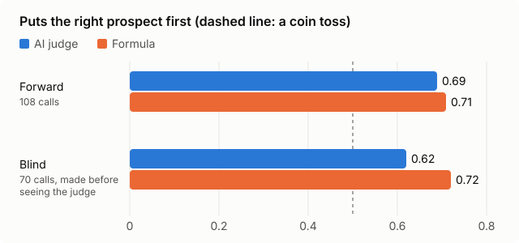

# My AI judge ranks sales prospects worse than a simple formula. Here is why I keep both.

*Joe Hahn · [JMH Data Sciences](https://jmh-datasciences.com) · September 2026*

An AI system that cannot show whether it works is guesswork. This one grades itself, and so far
the grade is not flattering.

## What the system does

I run a one-person AI consultancy. This repo is the pipeline I use to find clients: it reads
business news and conference agendas for firms with a dated reason to hear from me, reads each
firm's own website, ranks the people there, and drafts a first note. I edit and send every note by
hand. It never sends anything, and it never touches LinkedIn.

Two things rank each prospect, side by side:

- **An AI judge.** A language model reads everything on file about a person and rates, 1 to 5, how
  worthwhile a note would be. It is given no scoring rules. It is given my own past calls on the
  most similar people, with the reason I gave, and every point it makes has to cite evidence.
- **A formula.** A plain weighted score: the firm's size and sector, the person's seat, how recent
  the triggering event is, how reachable they are. No model, no learning.

The formula is there to be beaten. If the judge cannot out-rank plain arithmetic, its confident
explanations are decoration.

## How it is scored

Every time I mark a card *write first*, *would write* or *wouldn't*, that call is stored beside the
judge's rating and the formula's position at that moment. Both are asked one question: across every
pair of someone I would write to and someone I would not, how often does each put the right one
first? Half is a coin toss; 1.0 is perfect.

Two versions matter. **Forward** calls are every call made after the judge had rated the person.
**Blind** calls are the subset I made before seeing its rating, so its answer could not have
nudged mine. The first call on a person is the one scored, so a changed mind cannot flatter the
judge.

| Calls | Number of calls | AI judge | Formula |
|---|---|---|---|
| Forward | 108 | 0.69 | 0.71 |
| Blind | 70 | 0.62 | 0.72 |

On the measure that matches daily use, how many of my *write first* picks were in each system's
top five that day, the judge held 1 of 5 and the formula 2.

That is not the result I wanted. It is small numbers, so it is not settled, but it points one way,
and the blind number points there hardest.

## Why keep the judge at all

Because ranking is not all it does. The formula can tell me a person scores 0.24; it cannot tell
me why, or what to say to them. The judge explains every rating in evidence I can check, rates who
actually holds the budget, and learns from each call I make without anyone touching a weight. The
scoreboard decides whether that is worth paying for. On ranking alone, so far, it is not.

The judge also gives different answers to the same input. Language models are not deterministic,
so it rates each person three times and keeps the median, and the spread is shown. One run is
never treated as a measurement.

## What everything costs

Every model call is recorded the moment it is made: which model, tokens in and out, and cost. Over
the first five weeks that came to about **$123 across 4,600 calls**. Cost cannot be reconstructed
after the fact, which is why it is logged at the call.

That ledger is what makes it possible to right-size each step instead of guessing:

- **Reading a firm's website and extracting facts:** the smallest model, about 2 cents a firm.
- **Judging a person, three runs:** a mid-size model, about 4 to 5 cents.
- **Drafting the note:** the most capable model, about 22 cents a draft against 5 on the mid-size
  one.

The drafting choice came from a head-to-head: same person, same inputs, same instructions. The
mid-size model wrote a line of unfalsifiable filler it had already been told three times not to
write; the larger model was told once and wrote something specific. Drafting is the one step whose
output *is* the deliverable, so it gets the expensive model. Everything that is really
classification stays cheap.

## The week the judge earned its place

I opened the pipeline to a new kind of firm and admitted the first seven on the strength of what
kind of firm each one was. The judge rated four of them a 1, and it was right: my filter had checked
the category, not what each firm actually did. I added a check that reads each firm's own
description before admitting it. The next batch, from another city, is screened on that before
anything reaches the book.

The formula would not have caught that. It scored those firms on size and seat, which were fine.
That is the case for keeping both: the formula keeps the judge honest about ranking, and the judge
catches what no weight was written for.

## What transfers

The scores are specific to my prospects and my calls. The method is not:

1. Put a dumb baseline beside any AI judgment, and score both against real human decisions.
2. Separate blind calls from informed ones, or the AI will grade its own influence.
3. Run anything nondeterministic more than once, and report the spread.
4. Log model, tokens and cost on every call from day one, then pick each step's model on evidence.

The code, the prompts and the measurement are in this repo:
[how it works](../how-it-works.md) · [how it measures itself](../measurement.md).

*Testing AI judgment against a simple baseline, and paying only for the model each step needs, is
the kind of work I do at [JMH Data Sciences](https://jmh-datasciences.com).*
